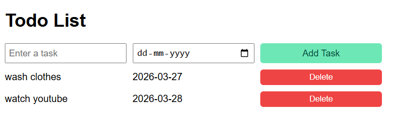

# 📝 Todo List App

A simple and beginner-friendly Todo List web app built using HTML, CSS, and JavaScript.

 ## 🚀 Features
* Add new tasks with a due date
* Display all tasks in a structured layout
* Delete tasks easily
* Simple and clean UI

## 📸 Project Preview

## 📂 Project Structure
* `index.html` → Main structure 
* `style.css` → Styling 
* `script.js` → Logic 

## 🛠️ How It Works
1. User enters a task and selects a due date
2. Clicks "Add Task" to add it to the list
3. Tasks are displayed dynamically using JavaScript
4. Click "Delete" to remove a task

## 🛠️ Tech Used

* HTML
* CSS
* JavaScript

## ▶️ How to Run
1. Download or clone the repository
2. Open index.html in your browser
3. Start adding your tasks 🎯

## 💡 Future Improvements
* Add edit task feature
* Add task completion (checkbox)
* Store tasks using localStorage
* Improve UI design

## 🙌 Author

Made by **Krishna**